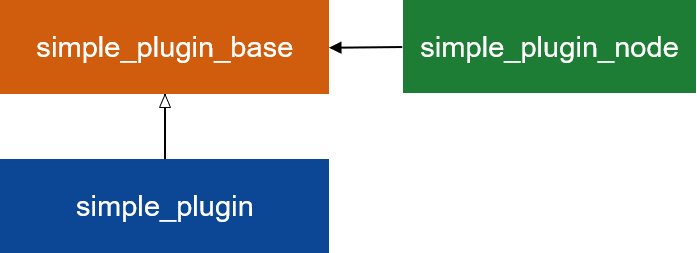

# ament_cmake_advanced

本ディレクトリは ament_cmake の発展的な使い方として以下のサンプルを提供する。

- plugin 作成
- ament 拡張

## plugin 作成

以下のパッケージは plugin 作成のサンプルとなっている。

- [simple_plugin_base](./simple_plugin_base/): プラグイン基底
- [simple_plugin](./simple_plugin/): プラグイン実装
- [simple_plugin_node](./simple_plugin_node/): プラグインを使用するノード

## ament 拡張

以下のパッケージは ament 拡張のサンプルとなっている。`ament_cmake_extension_usage` 内で `ament_package` が呼ばれたときに `ament_cmake_extension_caller` 内の [simple_ament_cmake_extension_hook.cmake](./simple_ament_cmake_extension/cmake/simple_ament_cmake_extension_hook.cmake) が呼ばれるという構成になっている。

- [simple_ament_cmake_extension](./simple_ament_cmake_extension/): ExtensionPoint の追加
- [ament_cmake_extension_caller](./ament_cmake_extension_caller/): ExtensionPoint への CMake ファイル登録
- [ament_cmake_extension_usage](./ament_cmake_extension_usage/): 登録した CMake ファイルの呼び出し

